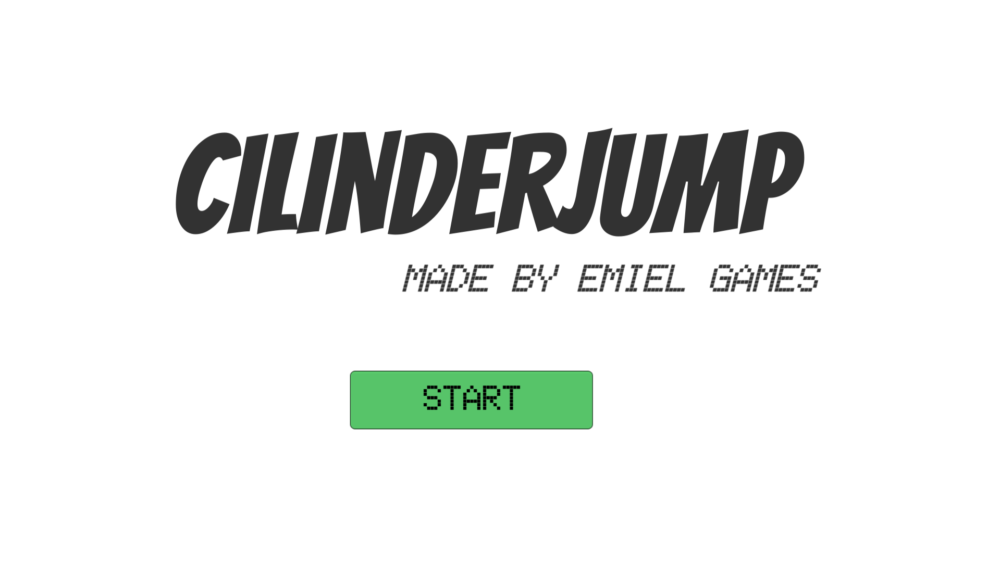
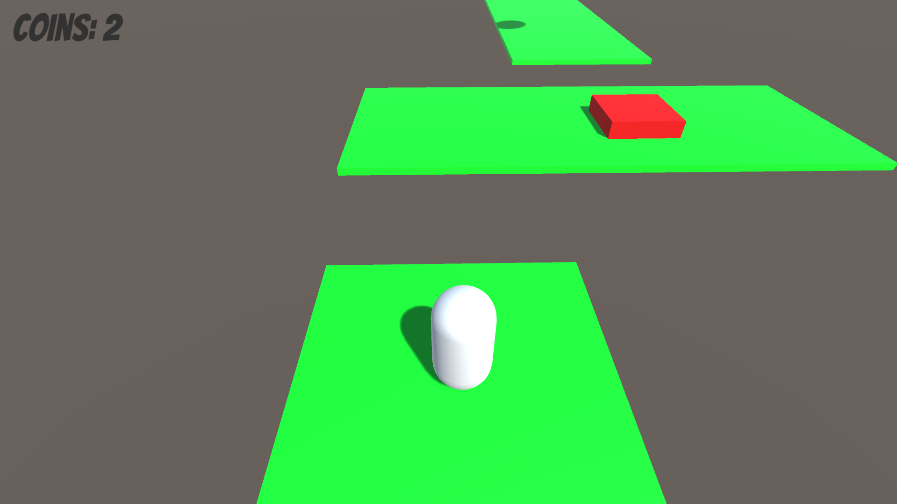
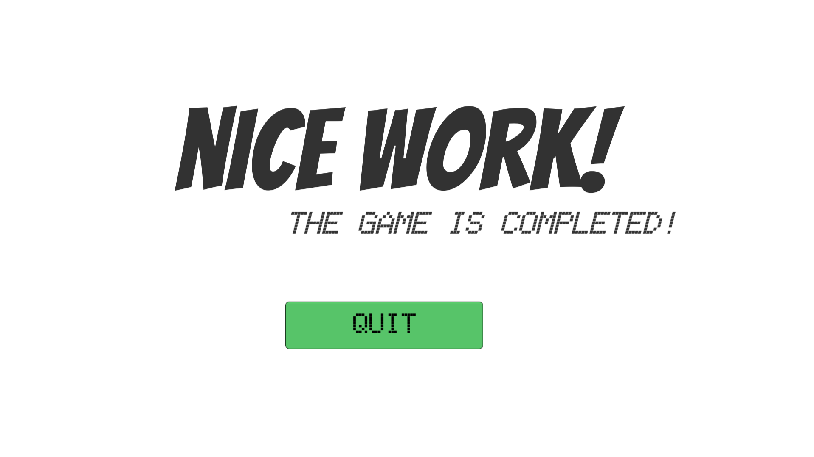

# 2022-cilinder-jump

>From main [README.md](../README.md): \
>"When I turned 10, I made games like *CilinderJump*, *Justified Jump*, *Dark Rings*, *FPS Jump* and *Uno Guys*. (and some others for family members but they will be excluded in this archive for personal reasons)"
This actually game was actually quite complete! (*unlike my others*)
It contained 3 levels, a game menu and an end screen. I created this around the time (actually before) ChronoApocalypse.

> **DISCLAIMER:** If you **don't** use a QWERTY keyboard the controls might not be correct, use your arrow keys instead.
 
For this game, the build is recovered, but the source code was not synchronized to the OneDrive and has been lost. 

This is an Unity game. **To play it, download the build from the [Releases](https://github.com/emielster/childhood-projects/releases/tag/cilinder-jump-2022) page.**