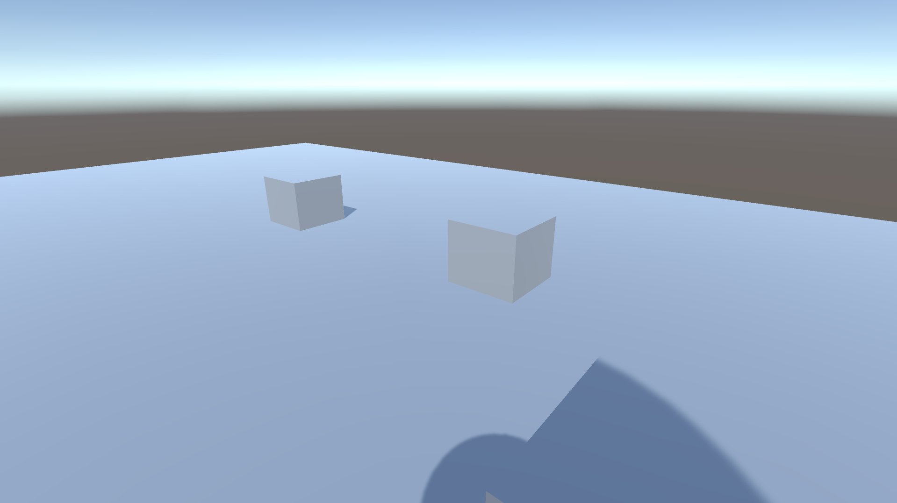

# 2022-fps-jump

*Yeah, it isn't the most exciting game. Though I successfully implemented a 1st person FPS camera.* 

     

>From main [README.md](../README.md): \
>"When I turned 10, I made games like *CilinderJump*, *Justified Jump*, *Dark Rings*, **FPS Jump** and *Uno Guys*. (and some others for family members but they will be excluded in this archive for personal reasons)"

For this game, the build is recovered, but the source code was not synchronized to the OneDrive and has been lost. 

This is an Unity game. **To play it, download the build from the [Releases](https://github.com/emielster/childhood-projects/releases/tag/fps-jump-2022) page.**