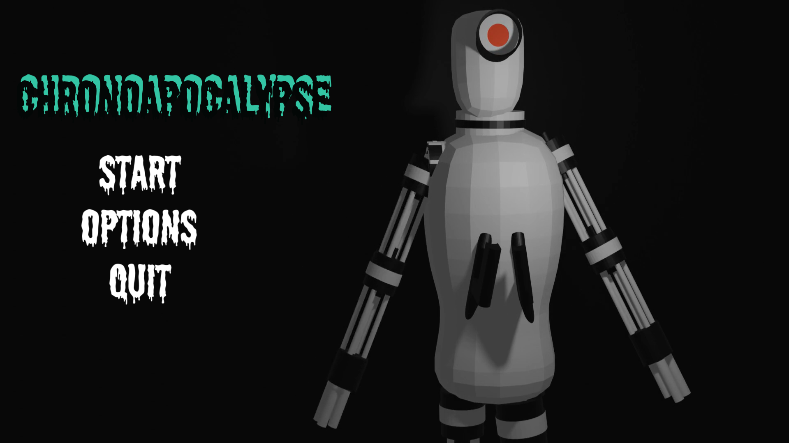

# 2023-chrono-apocalypse

 

     

>From main [README.md](../README.md): \
>"Additionally, I had a friend in elementary school, who was just as interested in computers as I was (or am). Together, we started plotting my first real serious game called *ChronoApocalypse*. We spent a lot of time discussing ideas, features and making lore and deciding what the game would become. I actually started working on it for quite a while. Unfortunately, when we hit middle school, we both ended up going seperate ways, and the project was left unfinished, just like the others. Despite that, *ChronoApocalypse* remains an important part of my programming journey, because it felt something real after a year of Unity design. It is included in the archive in case you want to try it out like everything else."

For this game, the build is recovered, but the source code was not synchronized to the OneDrive and has been lost. 

This is an Unity game. **To play it, download the build from the [Releases](https://github.com/emielster/childhood-projects/releases/tag/chrono-apocalypse-2023) page.**