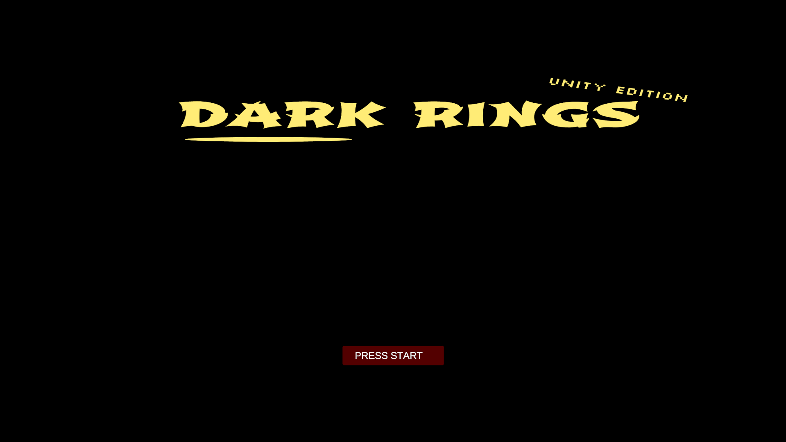
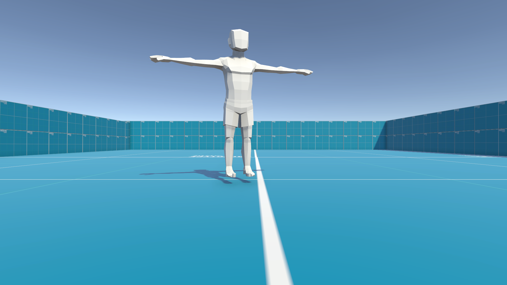

# 2023-dark-rings

*Yeah, that is it. I remember I tried making my own RPG, but it didn't go so good.*

>From main [README.md](../README.md): \
>"When I turned 10, I made games like *CilinderJump*, *Justified Jump*, *Dark Rings*, *FPS Jump*. (and some others for family members but they will be excluded in this archive for personal reasons)"

For this game, the build is recovered, but the source code was not synchronized to the OneDrive and has been lost. 

This is a Unity game. **To play it, download the build from the [Releases](https://github.com/emielster/childhood-projects/releases/tag/dark-rings-2023) page.**