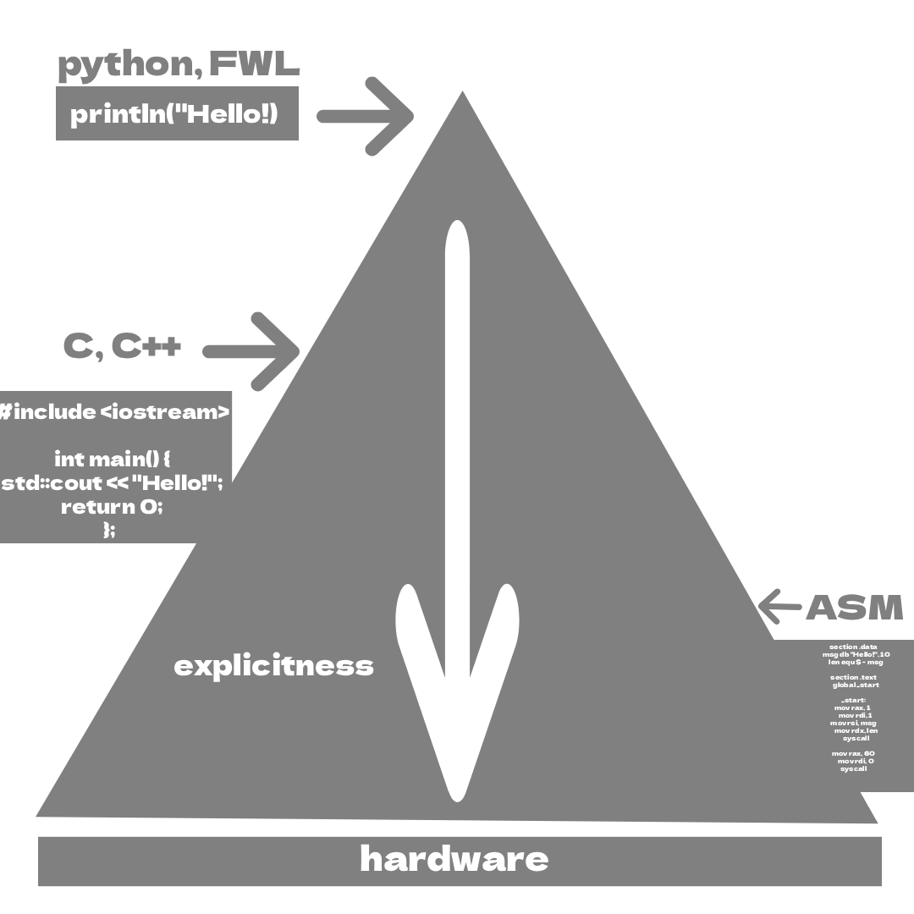
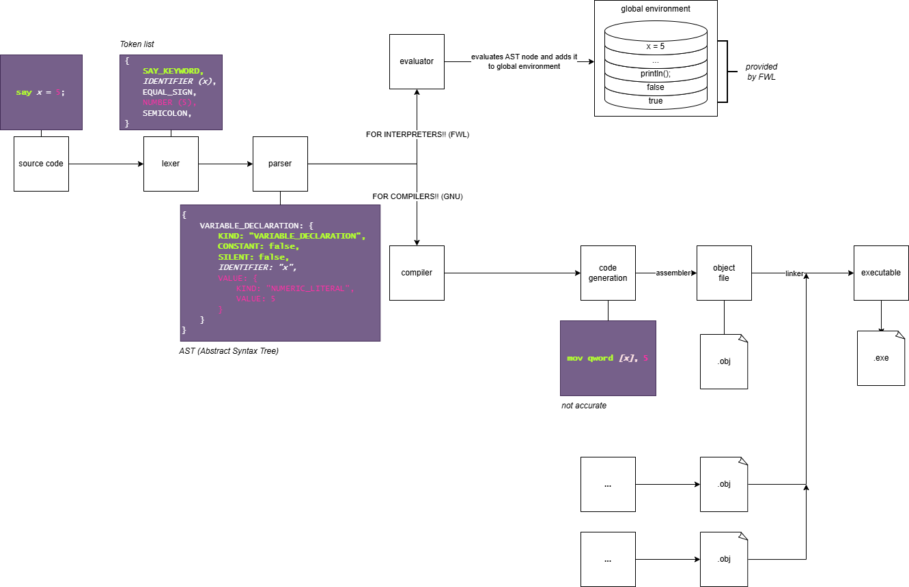

# fwl-documentation-how-it-works

> **NOTE:** Understanding this section is **not** required to write `FWL`. It is targeted at developers who want to know more about how `FWL` <sub>*and any other language*</sub> works under the hood. 

If you have read the `guide/` documentation, you probably already know that `FWL` is an **`interpreter`**. Another common type of language implementation is a `compiler`. What is the difference between the two? And how does `FWL` work?


## Interpreter

### Lexing or tokenization

Before the `interpreter` can do something, it needs to know *abstractly* what is in the file. It does that via a process called **`tokenization`**. Take a look at this piece of code in `FWL`:
```fwl
say x = 5;
```
The **`lexer`** goes over that text piece of code character by character and produces something like:
```pseudocode
{
    SAY_KEYWORD,
    IDENTIFIER (x),
    EQUAL_SIGN,
    NUMBER (5),
    SEMICOLON
}
```
Nothing is executed yet, nothing is abstractly analyzed. It just `breaks down the raw source code into `***`tokens`***<sub>(what the **`parser`** can work with)</sub>.

<picture>
  <source
    srcset="../assets/source-code-white.png"
    media="(prefers-color-scheme: dark)"
  />
  <source
    srcset="../assets/source-code-black.png"
    media="(prefers-color-scheme: light)"
  />
  
</picture> 

- [lexer.ts](../../project/frontend/lexer.ts)

### Parsing 

But what can we do with this? It is just a flat list of `tokens`, there is no structure in it yet. That is where the **`parser`** comes in.

The `parser` takes the list of tokens and produces an **`AST`** (*Abstract Syntax Tree*). That sounds confusing, but it's actually very simple. The parser produces:
<!-- 
export interface VarDeclaration extends Stmt {
    kind: "VarDeclaration";
    constant: boolean,
    whis?: boolean,
    identifier: string,
    value?: Expr,
}
-->
```pseudocode
{
    VARIABLE_DECLARATION: {
        KIND: "VARIABLE_DECLARATION",
        CONSTANT: false,
        SILENT: false,
        IDENTIFIER: "x",
        VALUE: {
            KIND: "NUMERIC_LITERAL",
            VALUE: 5
        }
    }
}
```
Let's go through this. The variable declaration has two `flags`<sub>(term in programming for a field in a structure that can either be true or false)</sub>: **`constant`** and **`silent`**. They are both set to `false`, because the variable is a changeable variable. 
The `identifier` is the name of the variable, so it is `x`. The `value` is what value the variable is assigned to, so it is `5` (*a numeric literal*). 


The `AST` is easier for the interpreter to work with rather than a flat token list because it has a form of structure.


<picture>
  <source
    srcset="../assets/source-code-white.png"
    media="(prefers-color-scheme: dark)"
  />
  <source
    srcset="../assets/source-code-black.png"
    media="(prefers-color-scheme: light)"
  />
  
</picture> 

- [parser.ts](../../project/frontend/parser.ts)
- [ast.ts](../../project/frontend/ast.ts)

### Evaluation

Finally, the program is **`evaluated`**. This is done by the **`evaluator`**.

As mentioned in the [tasks](../guide/tasks.md) documentation, the `interpreter` creates a **`global scope`** <sub>(AKA a **`global variable-environment`**)</sub> before executing the program.


> **NOTE:** it is important to note that constants like `true`, `false` and `built-in tasks` <sub>*(println(), input(), ...)*</sub>, are already added to the global environmment by `FWL` before any code is ran.

A `variable-environment` is essentially a `collection` of variables that the `interpreter` keeps track of. It can `add` variables to the list, or it `can lookup` variables of the list, or it can `can remove` variables of the list.  


When the `evaluator` encounters the variable declaration:
```fwl
say x = 5;
```
it evaluates the **`runtime value`** (`5`) and then adds a variable named `x` to the global scope.

After all statements have been evaluated, the program fixed executing.


<picture>
  <source
    srcset="../assets/source-code-white.png"
    media="(prefers-color-scheme: dark)"
  />
  <source
    srcset="../assets/source-code-black.png"
    media="(prefers-color-scheme: light)"
  />
  
</picture> 

- [interpreter.ts](../../project/runtime/interpreter.ts)
- [values.ts](../../project/runtime/values.ts)
- [environment.ts](../../project/runtime/environment.ts)
- [eval/expressions.ts](../../project/runtime/eval/expressions.ts)
- [eval/statements.ts](../../project/runtime/eval/statements.ts)

## Compiler

A `compiler` is interesting, because it doesn't directly `execute`<sub>(or `evaluate`)</sub> the source code. Instead, it translates the source code into a more **`low-level`** language, often **`assembly`**.

An `assembler` <sub>(*like `NASM` or `GNU Assembler (GAS)`*)</sub> turns that `assembly` into an **`object file`**, and then a `linker` combines `one or more object files` into an **`executable`**! 

> **FYI**: what is a "`low-level`" language and what is `assembly`? A `low-level` language  a language that is more explicit <sub>(and talks closer to the hardware/computer)</sub>. Compared to `high-level` languages like FWL and Python, it requires more effort to achieve the same thing. You have more control over the *CPU* and memory, but they are usually harder to write and understand.
>
>  
>
> `Assembly` is a prime example of a `low-level` language. It is a human-readable representation of machine instructions. Unlike machine code <sub>(such as `0001010`)</sub>, assembly uses `mnemonics` like `mov`, `add` and `jmp`, making it easy for humans to read and write.
>

I am not going to go in detail of how a compiler works, because it is really complex and it is out of the scope of this document.

## Overview

I have provided a small diagram to help you visualize it better:




