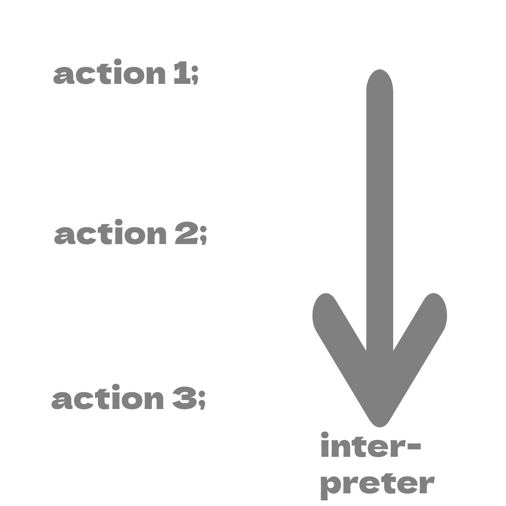

# fwl-documentation-syntax

> **TIP**: If you have never written code before, this might be useful to read. Otherwise, you'll probably have no problems understanding the syntax naturally.

## Basic principle of programming

When writing code, you do an action each line. The `interpreter` <sub>(program that interprets the raw text file and produces output in the console)</sub>  goes down line by line and by doing so, it executes the `action` <sub>(or instruction)</sub> from that line.



Thats all. You can also have a `compiler` but I wont go into these since FWL doesn't use it. 

## The semicolon (our biggest enemy)
In `FWL` <sub>(and most programming languages like C and C++, ...)</sub> you end each line with a `;` <sub>semicolon</sub>. 
This means you'll get something like this:
```fwl
action1;
action2;
...
```

Notice how I've been using `action` for each line? Well, in reality in `FWL` you'll either mostly do:

### A declaration
A declaration creates something that can be used later in the program.

For example:

```fwl
say x = 5;
``` 
<sub>(see [variables](variables.md) FYI)</sub>

or

```fwl
task do_something() {
    ...
};
```
### A call expression

This is when you send the interpreter to another line. To understand this fully, see my [task](tasks.md) documentation.

For example:

```fwl
do_something();
```

### An assignment

This is where you assign an existing [variable](variables.md) to a new value.

```fwl
x = 5;
```

> **NOTE**: `x` is already declared in this code snippet with for example: `say x = 3;` 

The syntax for each of these is different and you'll do it automatically when you learn each concept. **Don't worry if you don't fully understand what I just wrote!**