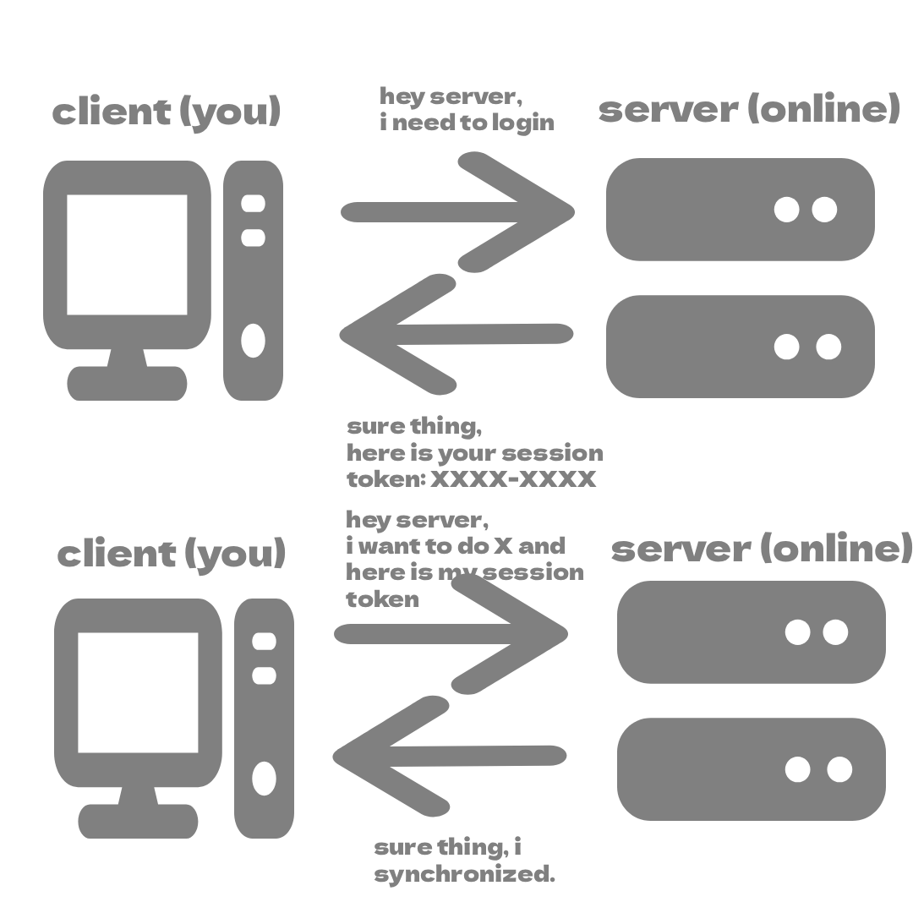

# fwl-documentation-variables

This is a fundamental concept of programming languages. Like I said in the [main README.md](../../README.md), a computer is "an universal language" that you see everywhere. You even see this concept in mathematics.

## Understanding it
In order to understand it, you can learn it via "the mathematics way" or the "boxes" way: 

<sub>(understand it already? click [here](#variables-in-fwl))</sub>

### 1. Via mathematics <sub>(⭐ easier to understand)</sub>
#### `x has a value`
In mathematics, you can have an equation such as:
```mathematics
x + 2 = 3
```
`x` is unknown. You don't know what x is, until you solve the equation for `x`:

```mathematics
x = 3 - 2
x = 1
```
Thus, `x` is equal to `1`. That means that `x` represents a `numeric value` <sub>(atleast when it comes to mathematics..)</sub>. 

#### `x can be any value`
Now go look at `functions`:
```mathematics
f(x) = x + 5
```
When you replace `x` with `1` you get:
```mathematics
f(1) = 1 + 5
f(1) = 6
```
Here, `x` gets replaced with `a numeric value`. `x` could be `20`, `30`, `35`, or any other valid number.

This idea is similar to a **`variable`** in programming. A variable is basically a "name" that refers to a value, and that value **can** change.

The name is even self-explanatory: `variable` means something that can change.

However, a variable can't be numeric only. It can be a `string` (a series of `characters`<sub>(like 'a', 'b', 'c'...)</sub>) or a `boolean` (either `true` or `false`).<sub>(and much more...)</sub>

In pseudocode: 
```pseudocode
x = 5

y = x + 3
```
`x` refers to the value `5` and `y` refers to the value `8`.
Both `x` and `y` are variables because they are names that refer to values.


### 2. Via boxes <sub>(⭐also easy)</sub>

Imagine a box labeled `x`.


Now you put a `5` in the box:


You can also take out the `5` and put in a `3`:


Now `x` is equal to `3`. `x` is thus changeable <sub>(meaning you can put any value in it)</sub>. 

Every time you refer to `x` you get the value in `x`. In other words, `x` is a name that refers to a changeable `value`. 

That `value` is not limited to numbers only, it can be a `string` (a series of `characters`<sub>(like 'a', 'b', 'c'...)</sub>) or a `boolean` (either `true` or `false`).<sub>(and much more...)</sub>

In pseudocode <sub>(what you just did)</sub>
```pseudocode
x = 5
x = 3
```
> **FYI**: `putting a value into x` is done with an equal sign, because `x` now refers to that value.

With this, you can create new `variables` that refer to another `variable`:
```pseudocode
y = x + 3
```
`y` is now equal to `x + 3`, which is `3 + 3`, which is `6`.

This is a fun and genius concept and it is the base of complex progams.

## Variables in FWL
In `FWL` <sub>(and many more languages)</sub> you have two variable types:

### Changeable variables
These are variables that can be assigned to any value, wherever you want. These are the most common.

In pseudocode:
```pseudocode
x = 2
y = x + 2
x = 3
y = 6
...
```
In `FWL`, these are `declared` with the `say` keyword:
```fwl
say x = 5; // this is declaration, x is set to a value here for the first time
x = 3; // note that you don't need the say keyword anymore after declaration!
x = 2;
say y = 2; // y is a new variable!
y = 2;
...
```
After `declaration`, you don't need the `say` keyword anymore to change the variable. Changing it to a new value after `declaration` is called `(re)assignment`.

### Constant variables
These are variables that can only be assigned to a value once in the code. It stays `constant`. It can't be `reassigned`.

In pseudocode:
```pseudocode
y = 3
y = 2 // ERROR!
...
```

In `FWL`, these are `declared` with the `yell` keyword: <sub>(notice the expressiveness of the language?)</sub>
```pseudocode
yell y = 5;
y = 3; // ERROR!
```

However, `FWL` introduces one more variable type: 

### Silent variables
This is quite difficult to understand, but these are variables that can be `deleted`, "`downed`" and `recovered` anywhere you want.

In pseudocode:
```pseudocode
x = 3
down x
// x is undefined here!
rec x
// x is recovered, x is 3
del x
// x is deleted. it cannot be recovered, unless you declare it again.
```


"`downing`" a variable means that the variable is `undefined` till you `recover` it. Think of it like *pausing* a variable's existence. `deleting` it means it is gone forever, unless you `declare` a new variable with the *exact same name*.

In `FWL`, silent variables are created with the `whis` keyword:

```fwl
whis x = 5;
down x; 
y = x + 3; // ERROR!
rec x;
y = x + 3; // WORKS
del x;
y = x + 3; // ERROR!
rec x; // ERROR!
```

#### Understanding the bigger picture

You might think: "But where will I possibly use it?". You can think of a silent variable like a `state machine`. 

Imagine this scenario. You have a variable called `session_token` that holds the token of when you log in, and each time you do an action and thus need to communicate with  the `server`, you show that `session_token` to show who you are.




But then, you log out. So, you `down` the silent variable. This is because the `server` invalidates your token, so using it in the code while you're logged out results in undefined behaviour. `down` makes the variable unusable until you `rec`over it.

And what do you know, you log back in a while later. You `rec`over and reassign your silent variable to a new session token.

This is a prime useful case of a `silent variable`:
```fwl
whis session_token = log_in();

// when doing an action:
do_x(session_token);

// when logged out or inactive:
log_out(session_token);
down session_token; // session_token is unusable

//...later...

// when logged back in or back active:
rec session_token;
session_token = log_in(); // log back in!
```


> **ADVANCED FYI**: `down` and `rec` is basically setting the `variable` to `null` in modern languages. My goal with FWL is to basically be a bridge to learning *C++*, so a silent variable is the equivalent to a `pointer` in C++, it can be `delete`d, it can be set to `nullptr`. But silent variables are much simpler, meant as a learning source for beginners. They also force you to think about lifetime, preparing you for C++ and other memory-explicit languages. 

## Changing variable type

You can change a variable type in `FWL` using the `drop` keyword:
```fwl
whis x = 3;

drop x to say;
// x is now a changeable variable
```
However, this is not recommended. It breaks the "`natural`" flow of variables.

## Summary

You have 3 types of variables:
- **Say** (changeable variables)
    - Can be reassigned
    - Are not constant
- **Yell** (constant variables)
    - Cannot be reassigned
    - Are constant
- **Whis(per)** (silent variables)
    - Can be downed and recovered
    - Can be deleted

To change between variable types, use the `drop` keyword.

