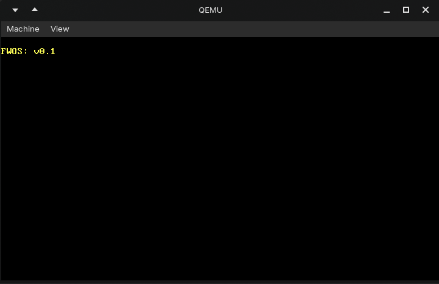
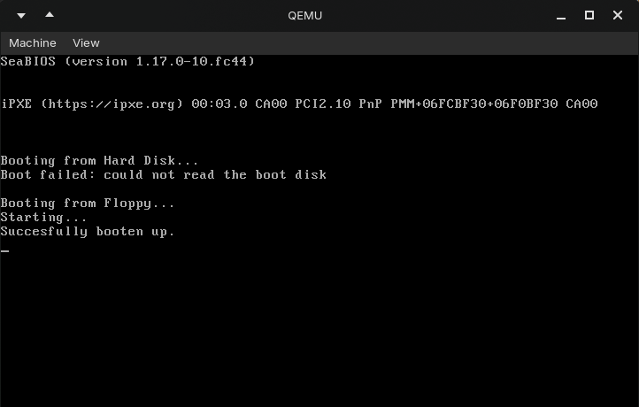

# 2023-fwos


<div align="center">

| [Normal (*rust*)](project/normal/) | [Beta (*assembly*)](project/beta) |
|--------|------|
|  |  |

<sub>*Yep, that is all. As you can see, I moved very quickly from this project to other projects.*</sub>

    
</div>

> From main [README.md](../README.md): \
> One of the biggest projects from that time was the "FW" Universe. It started as a simple idea (*FWL*, my own interpreter written in TypeScript), but it gradually grew into a much larger project (*FWK*, a "kit" containing all FW-products), including an IDE (*FWIDE*), **OS (*FWOS*)** and a NewScraper (*FWP??*) (although some of these projects were developed later). 

Along with [FWL](../2023-fwl/README.md), this was another *FW-product* I created as part of *FWK*. 
This project was not nearly as large as [FWL](../2023-fwl/README.md). I quickly became interested in other projects, so development stopped early.

At some point shortly after writing the original *Rust* version, I rewrote the project in Assembly. They are both provided in this archive.

To install the **Beta** version of FWOS (*Assembly*), I have provided the `.img` file which you can boot directly in an `emulator`.


## Installation
### 1. QEMU
First, you need to install QEMU. It is an emulator can run the operating system.
#### Windows
Via the **website**:

Install it from [here](https://www.qemu.org/download/#windows)

Via **`winget`**:
```bash
winget install QEMU.QEMU
```

#### macOS
Via **`homebrew`**:
```bash
brew install qemu
```

#### Linux
For **Fedora** via **`dnf`**:
```bash
sudo dnf install qemu-system-x86
```
For **Arch Linux** via **`pacman`**:
```bash
sudo pacman -S qemu-desktop
```
For **openSUSE** via **`zypper`**:
```bash
sudo zypper install qemu-x86
```

### 2. Normal version

#### Run boot image (⭐ recommended)

Install the `normal` (*Rust*) version via [Releases](https://github.com/emielster/childhood-projects/releases/tag/fwos-normal-2023)

#### Build it yourself
##### 1. Prerequisites:
- [Rustup](https://rustup.rs/)

##### 2. Clone the GitHub repo
```bash
git clone https://github.com/emielster/childhood-projects
cd childhood-projects/2023-fwos/project/normal/
```
##### 3. Install nightly
```bash
rustup toolchain install nightly-2023-01-01
```
##### 4. Install Rust source files
```bash
rustup component add rust-src --toolchain nightly-2023-01-01
```
##### 5. Install LLVM tools
```bash
rustup component add llvm-tools-preview --toolchain nightly-2023-01-01
```
##### 6. Add the ARM target
```bash
rustup target add thumbv7em-none-eabihf --toolchain nightly-2023-01-01
```
##### 7. Build using the custom x86_64 target
```bash
cargo +nightly build --target x86_64-fwos.json
```
##### 8. Install bootimage
```bash
cargo install bootimage
```
##### 9. Run it!
```bash
cargo bootimage
```
```bash
qemu-system-x86_64 -drive format=raw,file=target/x86_64-fwos/debug/bootimage-fwos.bin
```

> **NOTE**: If you are on Windows, you can also use the `.bat` files I made in 2023. These scripts might break (<sub>because I don't want to change them for the archive</sub>), so it is better to follow along with these steps.


### 3. Beta version

#### Run floppy disk (⭐ recommended)
Install the `beta` (*Assembly*) version via [Releases](https://github.com/emielster/childhood-projects/releases/tag/fwos-beta-2023)

#### Build it yourself
##### 1. Prerequisites:
- [Mtools](http://mtools.linux.lu/mtools.html)
- [GNU make](https://gnuwin32.sourceforge.net/packages/make.htm)

##### 2. Clone the GitHub repo:
```bash
git clone https://github.com/emielster/childhood-projects
cd childhood-projects/2023-fwos/project/beta/
```
##### 3. Build with Make:
```bash
make
```
##### 4. Run with QEMU:
```bash
qemu-system-i386 -fda build/main_floppy.img
```
