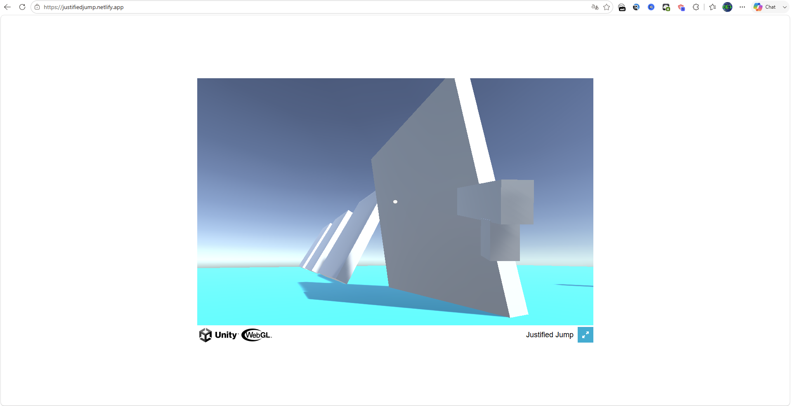
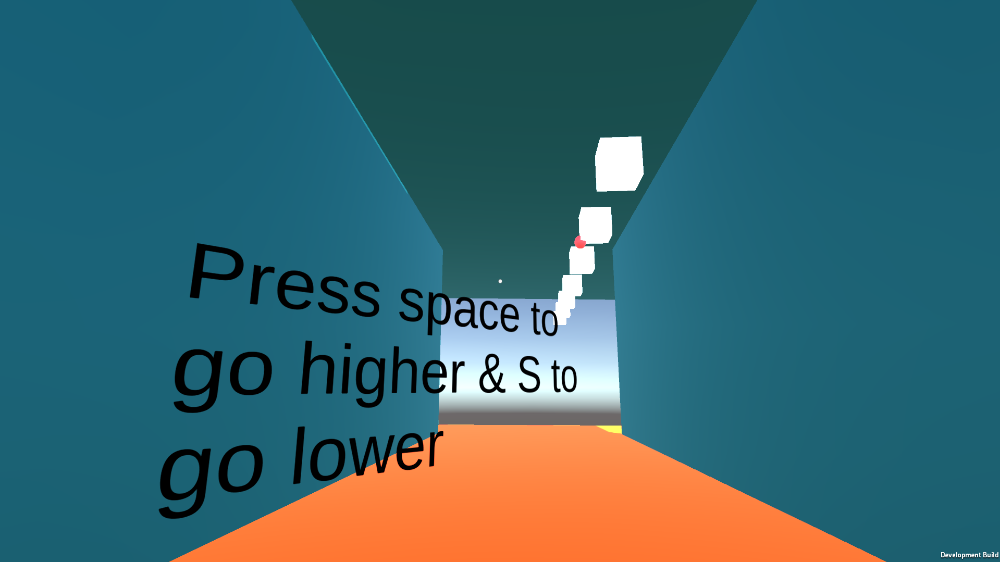
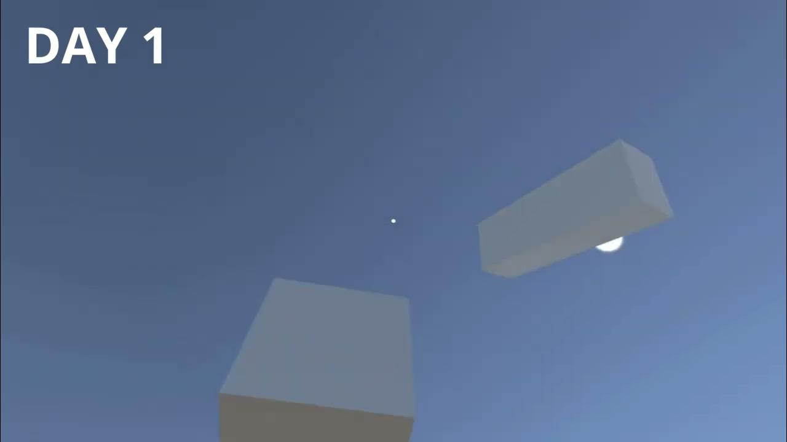
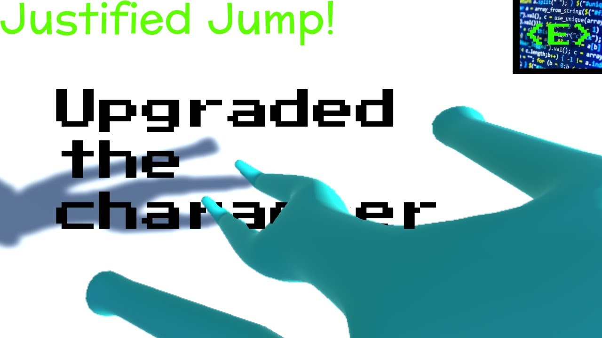
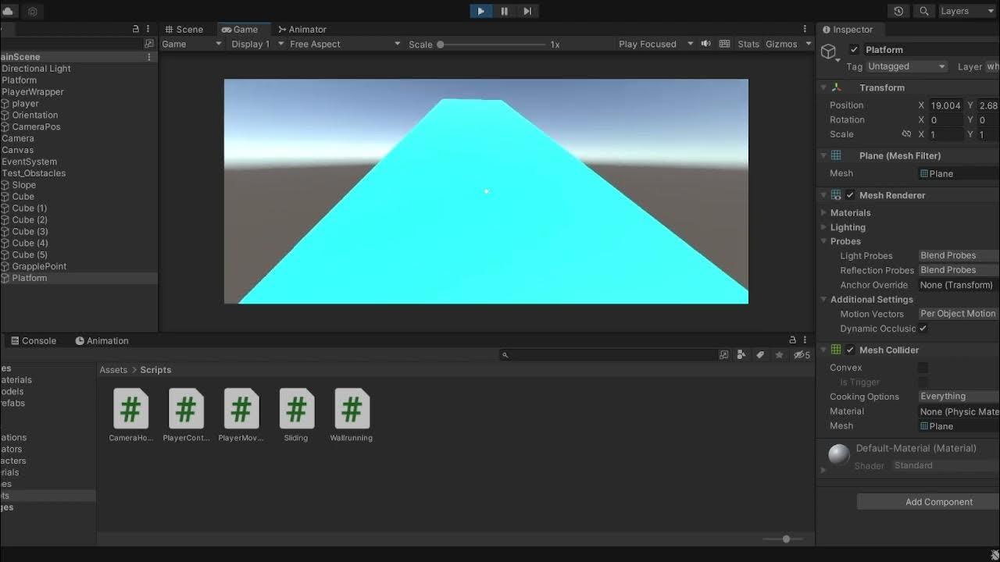
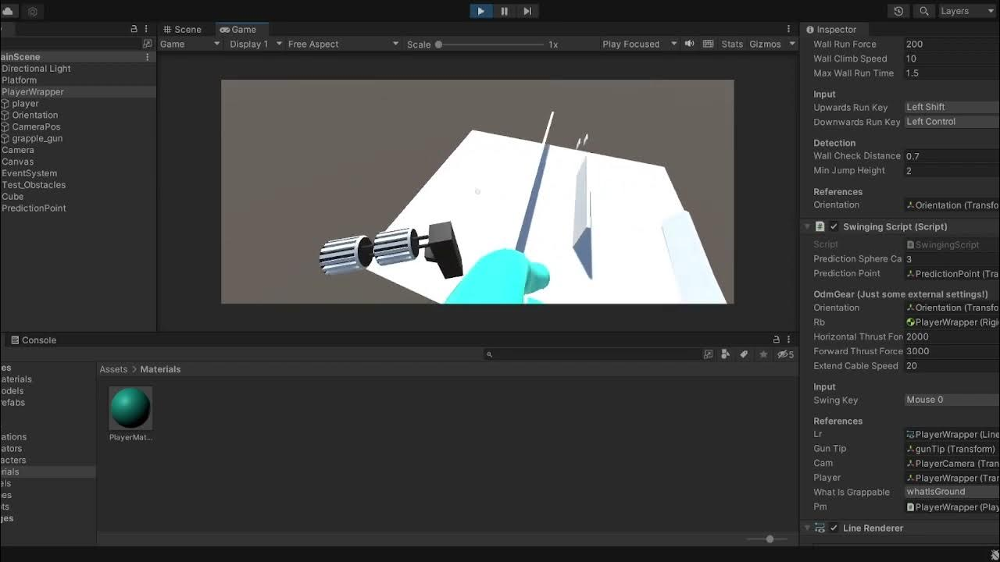
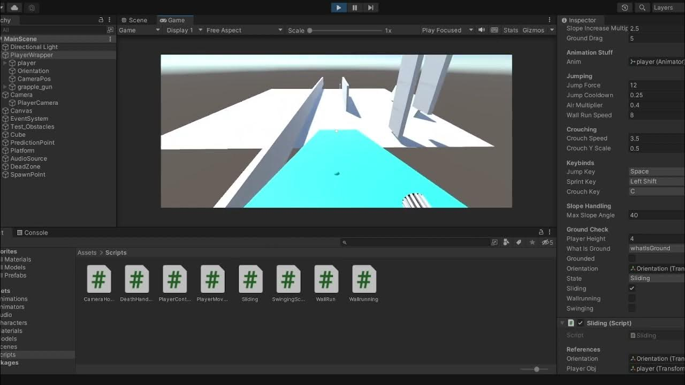

# 2023-justified-jump
| WebGL                                                             | Unity Runtime |
|-------------------------------------------------------------------|---------------|
|   | 

*I found multiple versions of this game. I even uploaded it to Netlify for whatever reason! (but it is an older version)*

You can play the WebGL version here: [https://justifiedjump.netlify.app](https://justifiedjump.netlify.app)

>From main [README.md](../README.md): \
>"When I turned 10, I made games like *CilinderJump*, *Justified Jump*, *Dark Rings*, *FPS Jump* and *Uno Guys*. (and some others for family members but they will be excluded in this archive for personal reasons) 
Justified Jump was a game I made for an (online) friend called JustifyDust. You can also find this [at my Itch IO](https://unityemiel.itch.io/justified-jump), since I actually uploaded it at that time."

I had so much fun making this. It was a (half) complete game, it even had a tutorial! 

Luckily, I recorded some of the progress of the game on my YouTube. 
| Part | Thumbnail | Link |
|------|-----------|------|
| Day 1 |   | [https://youtu.be/4MqCetorfFs](https://youtu.be/4MqCetorfFs)
| Character Upgrade! |  | [https://youtu.be/D6vXTdb0I1U](https://youtu.be/D6vXTdb0I1U) 
| Added sliding/wallrunning |  | [https://youtu.be/8Liy1Ogwing](https://youtu.be/8Liy1Ogwing) |
Grappling mode "and better aim" |   | [https://youtu.be/LqjceEjSC5Q](https://youtu.be/LqjceEjSC5Q) |
3D audio |  | https://youtu.be/nG6c6Om2xyA |

<!-- For anyone reading this raw MD (who actually does this), I just use Youtube's content provider, instead of downloading it and uploading it to the repository. Its much easier. Anyways, it is like 1 AM at the time of writing this so yeah wish me good luck! -->
<!-- One day later: uhgh all of these links were all of the sudden invalid. Updated all the images to images in screenshots/ . Updated advice: don't do thnat lol!-->

For this game, the build is recovered, but the source code was not synchronized to the OneDrive and has been lost. 

This is an Unity game. **To play it, download the build from the [Releases](https://github.com/emielster/childhood-projects/releases/tag/justified-jump-2023) page.**
<!-- TODO -->