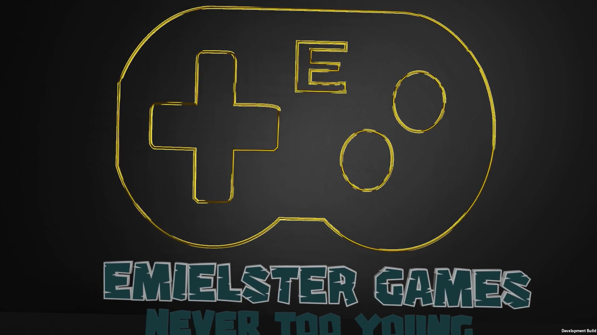
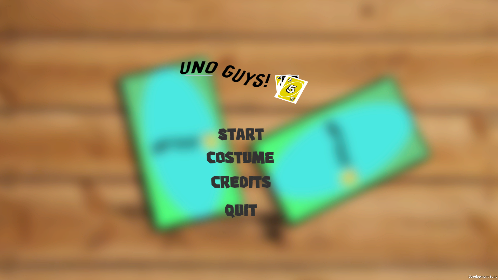
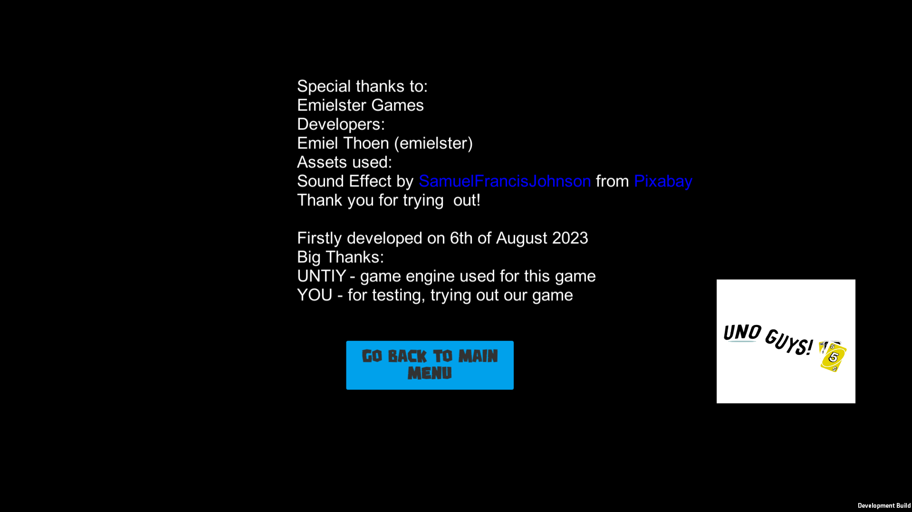

# 2023-uno-guys

     

>From main [README.md](../README.md): \
>"When I turned 10, I made games like *CilinderJump*, *Justified Jump*, *Dark Rings*, *FPS Jump*. (and some others for family members but they will be excluded in this archive for personal reasons)"

I actually remember developing this game.
> **A piece of advice:** If you are developing a game, **start with your actual core game mechanics**, not something like the splash screen or main menu. I did this a lot because I found it really fun to make these. But then, when it was time to start with the actual game, I quit the development because it was hard and difficult.

Nothing much is in this game except of the splashscreen and main menu. Lol.

For this game, the build is recovered, but the source code was not synchronized to the OneDrive and has been lost. 

This is an Unity game. **To play it, download the build from the [Releases](https://github.com/emielster/childhood-projects/releases/tag/uno-guys-2023) page.**