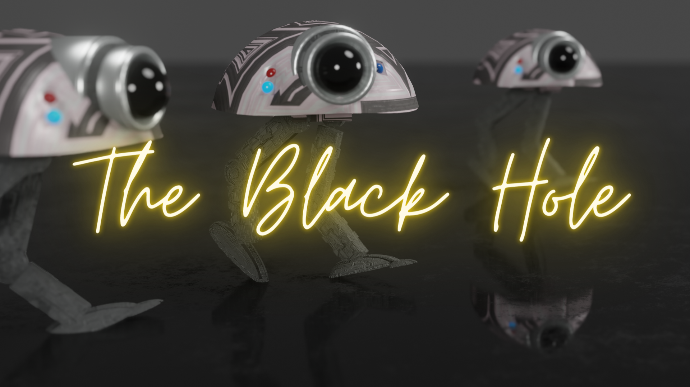
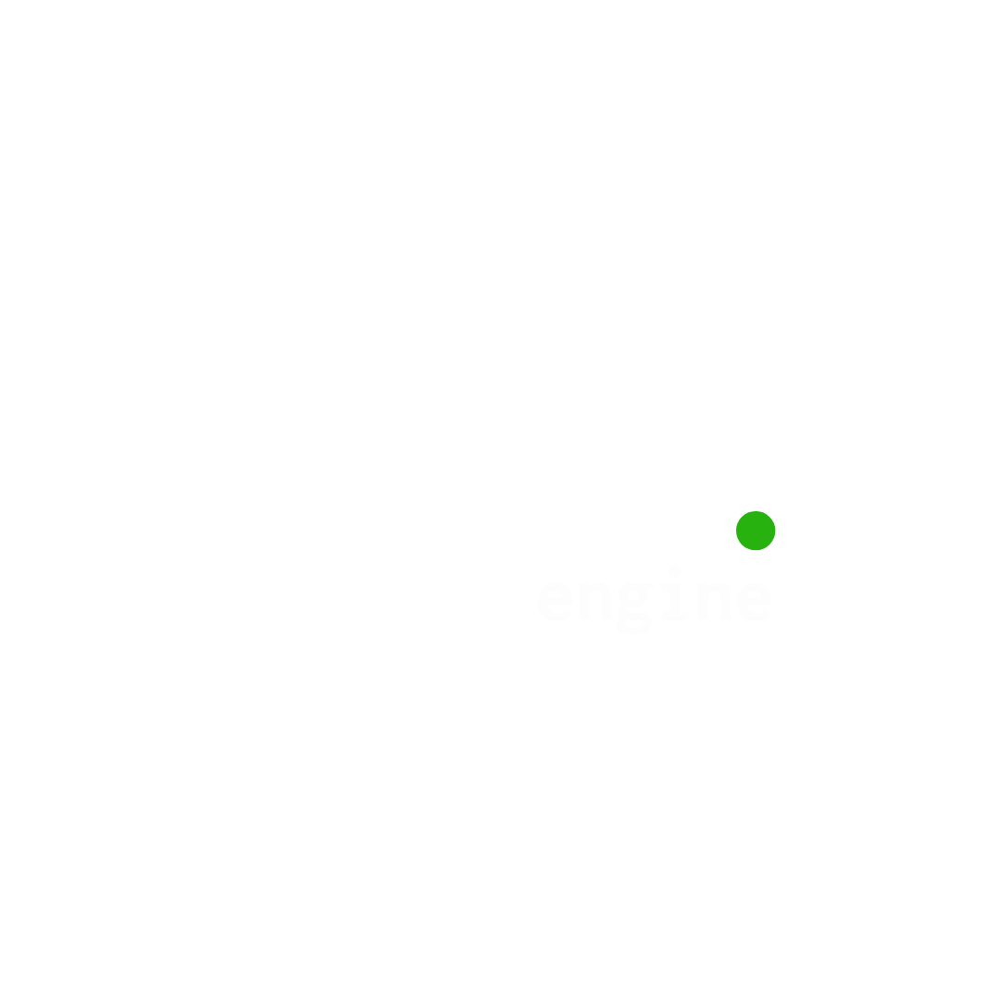
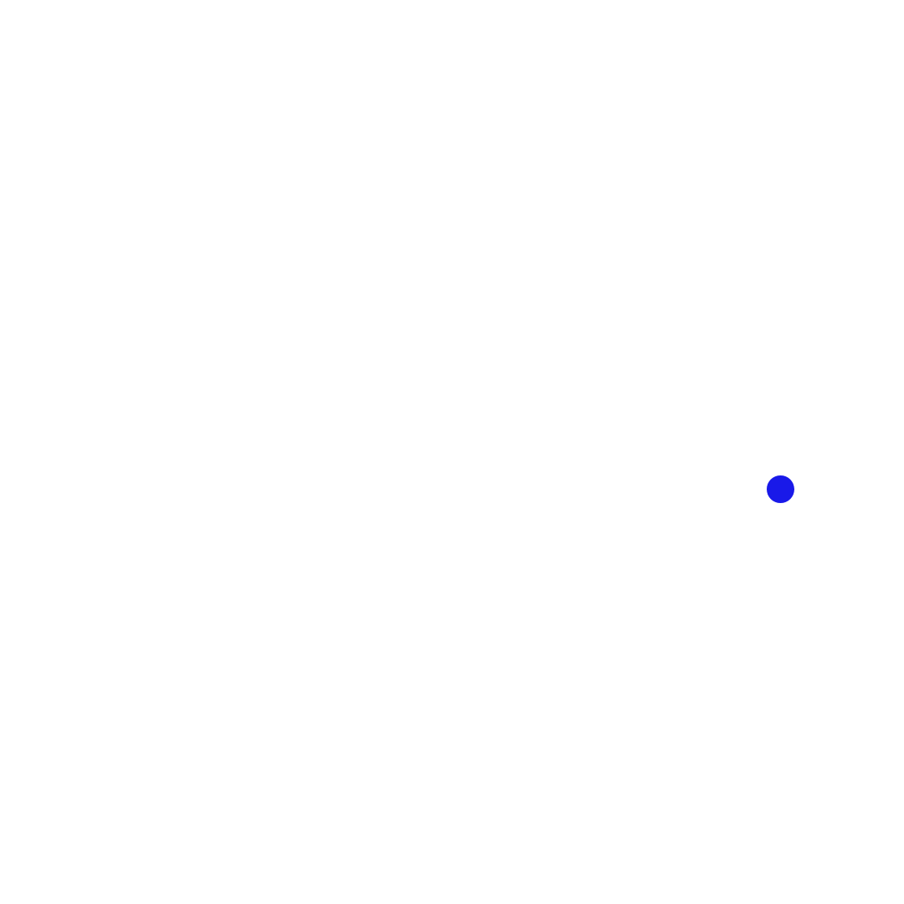

# childhood-projects
*Never too young.* (I made this tagline when I was 11)

> This is an archive of my childhood projects (when I was 10-14). This README will talk about my story, and I will explain why this is called an "archive".

> Some projects are unfinished or unusable. I've done my best fixing the code. You can find more information about each project in the README.md of each directory in this repository. Have fun!

🎙️🎧 *Prefer to listen? [Hear the story](assets/childhood-projects-README.mp3)* (⭐ recommended)
## Why would you visit? Why would you care?
This archive can mean many things:
- A portfolio of the projects I created between the ages 10-14.
- A collection of code and ideas that may be useful as a resource or inspiration.
- A collection of games and applications you might enjoy exploring.
- A snapshot of how my programming began.
- A tutorial of how to program with my FWL language.
- ...

Because this archive holds many different projects, people may find value in it for different reasons. 

For me, however, this archive represents something more personal. That is, a missing piece of my childhood that I thought had been lost forever.

## Table of Contents
- [My story](#my-story)
    - [Starting out](#starting-out)
    - [Advancing as a programmer](#advancing-as-a-programmer)
        - [Unity and Godot games](#unity-and-godot-games)
        - [My own shortfilm](#my-own-shortfilm)
    - [The productive period](#the-productive-period)
        - [The Flexible Water universe](#the-flexible-water-universe)
        - [Low level programming](#low-level-programming)
        - [My own virus!](#my-own-virus)
        - [In the meantime](#in-the-meantime)
    - [The disaster](#the-disaster)
        - [Summer of 2024](#summer-of-2024)
        - [Regret](#regret)
- [The future of my story](#the-future-of-my-story)
    - [My projects](#my-projects)
    - [My philosophy](#my-philosophy)

## Projects

| Project | Description | Language |
|---------|-------------|----------|
| [CilinderJump](2022-cilinder-jump/README.md) | A jump-based platformer game (⭐) | C# / Unity |
| [JustifiedJump](2023-justified-jump/README.md) | A parkour game I made for a friend (⭐) | C# / Unity|
| [Discoball.exe](2023-discoball-exe/README.md) | A *harmless* toy virus I made (⭐) | Python |
| [FWL](2023-fwl/README.md) | My own interpreter written in TS (⭐) | TypeScript (TS)f
| [FPSJump](2022-fps-jump/README.md) | A prototype with a FPS camera | C# / Unity |
| [ChronoApocalypse](2023-chrono-apocalypse/README.md) | A story game I made with a friend | C# / Unity
| [DarkRings](2023-dark-rings/README.md) | My attempt at making a RPG game | C# / Unity|
| [UnoGuys](2023-uno-guys/README.md) | My attempt at making a strategy game (foreshadowing, didn't get far) | C#/Unity |
| ... | ... | ...

(⭐ indicates that this project is my favorite )

## My story
### Starting out
I was 8-9 when I got introduced to computers for the first time. My parents bought a Chromebook for family use at that moment.

I became fascinated with computers extremely fast. It was a Chromebook, so it came packed with Google stuff. That way I quickly got into Google Apps like GMail, Google Drive and Google Slides. 

I became a master at Google Slides, and it was pretty cool at that time, not only for elementary school (*when it came to Google Slides, lots of people wanted to pair up with me*), but to make and share slides with my family. I got so good with every feature of Google Slides, that at one time I discovered a feature called "*App Scripts*".

I clicked on it - and it was the first time in my life that I got in contact with a coding language. It was *JavaScript*, used for some advanced way of making slides. (or something like that :p)

I got immediately filled with curiosity, and decided to look for a t<utorial online on how to code JavaScript. 

But I didn't stop there, I saw that JavaScript was also used to build cool things like websites. I watched a JavaScript, HTML and CSS tutorial on YouTube and got informed fast.

I decided to build a calculator, which was my first website (or one of the first websites) that I built. I can't remember this exactly, because it is a long time ago. The calculator one is the only website I can remember.

I don't exactly remember what I did next, but I probably learned Luau for Roblox Studio and Python and C# for Unity.

You can find my Roblox projects [at my Roblox profile.](https://www.roblox.com/users/1749382965/profile)

>One thing that stands out to me when looking back at these projects, is how often that I jumped from one idea to another.

>**My piece of advice to new programmers:** Try to *focus on one project*.  
Iterating through projects is easy to do, because you get the joy of building a new project and quit when it starts getting boring.
But you'll never actually fully ship something. That was one of my troubles. 

>Additionally, you will build a much stronger skillset in a specific domain (*that is actually valuable*), instead of having "a little bit experience of everything". Building things is one of the (*if not the*) best way to learn. This is true for almost any field, whether it's mathematics, learning a language, or programming. "You can learn how to drive a car by reading, but you'll only truly learn when you hit gas and start gaining experience."  

**[↑ back to top ↑](#childhood-projects)**

### Advancing as a programmer

#### Unity and Godot games

When I turned 10, I made games like *CilinderJump*, *Justified Jump*, *Dark Rings*, *FPS Jump* and *Uno Guys*. (and some others for family members but they will be excluded in this archive for personal reasons) 

Justified Jump was a game I made for an (online) friend called JustifyDust. You can also find this [at my Itch IO](https://unityemiel.itch.io/justified-jump), since I actually uploaded it at that time.

Additionally, I had a friend in elementary school, who was just as interested in computers as I was (or am). Together, we started plotting my first real serious game called *ChronoApocalypse*. 

We spent a lot of time discussing ideas, features and making lore and deciding what the game would become.
I actually started working on it for quite a while. Unfortunately, when we hit middle school, we both ended up going seperate ways, and the project was left unfinished, just like the others. 

Despite that, *ChronoApocalypse* remains an important part of my programming journey, because it felt something real after a year of Unity design. It is included in the archive in case you want to try it out like everything else.

#### My own shortfilm

In the winter of 2022, I tried making my own shortfilm in Blender (*a 3D modeling/animation free software*) called "*The Black Hole*".

Here is a picture:

*Logo I made in Blender at that time*   

Unfortunately, the project ended up being abandoned.

**[↑ back to top ↑](#childhood-projects)**

### The productive period

Then came the summer of 2023. It was probably one of the most productive periods in my entire life. I was 11 at that time.

For whatever reason, I became completely obsessed with building things. I spent countless hours coding, experimenting, and starting new projects. 

#### The Flexible Water universe

One of the biggest projects from that time was the "FW" Universe. It started as a simple idea (*FWL*, my own interpreter written in TypeScript), but it gradually grew into a much larger project (*FWK*, a "kit" containing all FW-products), including an IDE (*FWIDE*), OS (*FWOS*) and a NewScraper (*FWP??*) (although some of these projects were developed later). 

One of my favorite things about FWL was its syntax. Instead of using traditional keywords, I tried to make the language more *expressive*: `say` created normal variables, `yell` created constants, `whisper` created silent variables that could be overwritten or deleted. 

I remember that I spent the entire summer working on it, even when I was on vacation. It shows my passion for programming.

#### Low level programming

At the same time, I became fascinated by lower-level programming and computer systems. Instead of only building games and applications, I wanted to understand how computers actually worked. This curiosity eventually led me to experiment with operating system development.

Learning assembly, writing my own *toy* bootloader and kernel taught me a lot. I think that a computer is an universal language and once you *grasp* that fundamental concept about low level computing you can understand everything else more easily.   

#### My own virus!

Funny enough, I also created my *harmless* toy virus called Discoball.exe. When looking through the project, I find it funny that my younger self wrote: "RUN AT YOUR OWN RISK!!!", but the only thing it does is rotate your screen 180° and play some annoying music.

#### In the meantime

In the meantime, I was really active on Roblox and created my own tiny games, and in the schoolyear of 2023-2024 I even coded my own 3D graphics engine in a Roblox game!

Another project I remember, "*a New Year Automatic Countdown*". I created it on December 31, 2023. As the name suggests, it was a program that automatically counted down to the new year. I remember that me and my family actually celibrated new year with that countdown!

I also made some smaller applications, such as RoCHAT, a chat application. It was the first project I built that involved networking, and it introduced me to the idea of computers communicating with each other over a network.

Another project I created was GhiyAI, which was once again made for that same friend of ChronoApocalypse. Through this project, I was introduced to machine learning for the first time. Although it was extremely limited compared to modern AI models, I just found it fascinating that I could create something that actually responds *human-like* on my own computer. 

**[↑ back to top ↑](#childhood-projects)**

### The disaster
#### Summer of 2024

When I turned 12, nothing much happend during the school year because I just got into middle school. 

However, in the summer I spent a lot of time working on a Roblox Game called [*Hover's RNG*](https://www.roblox.com/games/17302628846/hovers-rng). It was a RNG (*Random Number Genator*), which was very popular at that time. The name comes from a friend I had at that time, because we allegedly created it together, although I was doing all the work :p.

#### Regret
After the summer, I got busy with school and I didn't do much.

But then, in the winter of 2024, I finally got a new PC. At the time, I believed my old laptop had served it purpose. Most of my projects were still on it, but I didn't think much of it and eventually **sold it**.

Around the same time, I also decided to delete my old GitHub account (https://github.com/Emielster). The reason was that it said that I was 11 years old, even though I wasn't.

One of the worst decisions in my life.

As far as I knew, all my projects were **gone forever**. 

For more than a year, I believed that years of learning, experimenting, and building had disappeared. I thought the only evidence left of that period was an old livestream on my YouTube.

Until June 24 2026.

I decided to watch that livestream again, and I saw that I opened File Explorer and that I had OneDrive.

I logged into OneDrive using my old e-mail. 

And they were there.

Every project. Years of work that I thought had been lost forever, but it was quietly on OneDrive *the whole time*!

Finding those files again felt like rediscovering a piece of my childhood. 

That is why I created this repository. I want to upload all of my old projects to GitHub again, because they represent an important part of my journey as a programmer.

>**So my advice to every programmer:** Never delete your (old) projects, even when you don't care anymore. I was lucky enough that they were synchronized to OneDrive, but you might not be.

>All of these projects are created before "vibecoding" was a thing, so they are all written by me (with 10+ StackOverflow tabs probably :p).

**[↑ back to top ↑](#childhood-projects)**

## The future of my story
### My projects

<picture>
	<source media="(prefers-color-scheme: dark)" srcset="assets/mint-engine-white.png" />
	<source media="(prefers-color-scheme: light)" srcset="assets/mint-engine-black.png" />
	
</picture>
<picture>
	<source media="(prefers-color-scheme: dark)" srcset="assets/thinkify-app-logo-white.png" />
	<source media="(prefers-color-scheme: light)" srcset="assets/thinkify-app-logo-black.png" />
	
</picture>

Currently, I am working on several **consistent** projects like Thinkify and Mint Engine. 

I hope to actually finish them, *which I think will happen*, because Mint Engine is already at 10K LOC. Thinkify is also approaching 5K LOC. 

These projects will have no paywall, and they are completely open-source. If there is something that generally costs money, *like hosting a website*, it is on your end and it is in your control. (*like for Thinkify, you need to host a website, but you can generally do it for free*)

### My philosophy

I find it *extremely* important that projects are completely open-source, and that they have no paywall. 

As long as I have enough money for groceries, a decent car, a decent house, I don't care about making profit.

As a young developer who couldn't buy anything on the Internet, I ran into this constantly. I needed to use Photoshop, Premiere Pro, tools that should just *exist*, but they weren't free. 

Any developer deserves the right to get all the tools they need for free, without a paywall. Developing should be free.

